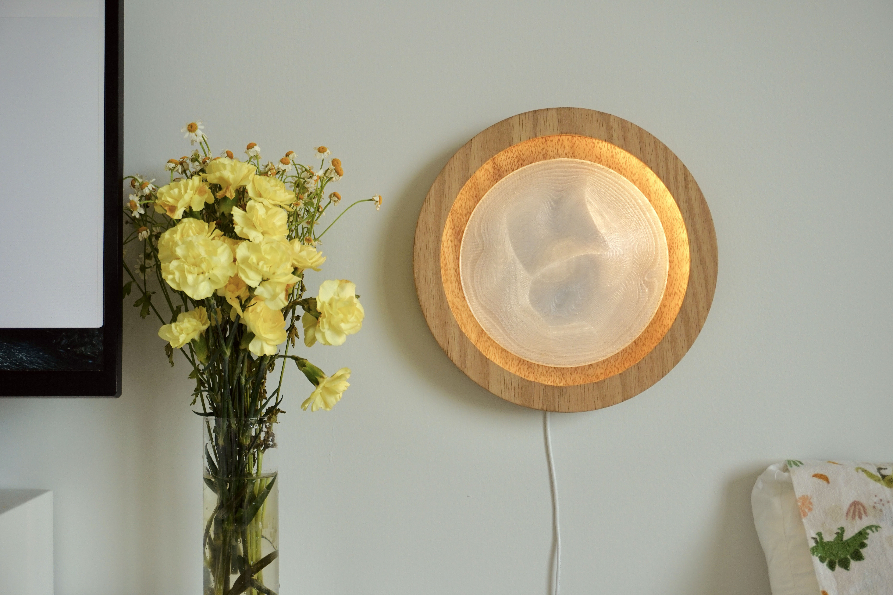

Dune is a lamp designed for massage waiting rooms. Inspired by the Japanese dry garden / zen garden, we hope to bring an experience of peace, meditation, and emptiness by praising the circular movements of shadows created through the miniature landscape lightened by dynamic LED, in order to help patients breathe and relax. Co-created by [Marcel Wang](https://yiranwang.art/) and Jason Gao.

Our lighting design is made for the Massage Therapy Clinic. Massage achieves various balances of bodily functions by activating acupoints in different body parts to unblock the meridians, following the law of natural yin and yang balance.Considering massage therapy itself helps reduce stress and release pain, our lighting design is more focused on the decoration side of the clinic. In addition, we assume that patients who come to massage therapy clinics look for a relaxing and comfortable experience compared to patients who go to the hospital for treatment. So our goal is to create a cozy and satisfying add-on to the waiting room.

We used two rows of LED strips: the static one provides the base neutral brightness for the lamp, and the other one is animated at a certain speed to warmly lighten up the middle structure - the dune. The dune is generated using Blender's geometry node with Voronoi texture and get printed using transparent PET-G. The layer-by-layer printing method of 3D printing shows the shape and texture of the dune flowing curve perfectly. The shadow created through animated LED and fluctuation is subtly changed over time. The choice of wood material was also referred to the studies that believed that visual contact with wood material positively affected the brain and autonomic nerve activity.

## Resources

- [Download PDF](./Dune.pdf)
- [View Bill of Materials](https://docs.google.com/spreadsheets/d/14_knVQdDCQbgbgffJhhdWRG21sqDkRrjMwO6SobgPtc/edit)
- Code & 3D Models: <https://github.com/jasongao97/dune>

---
