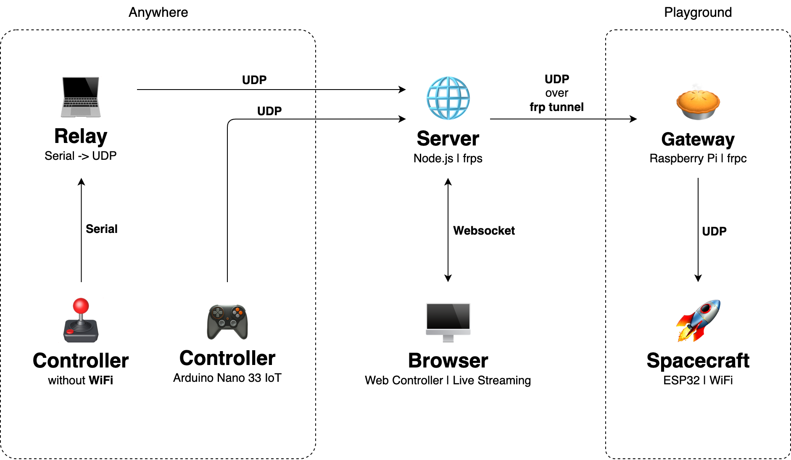

In this pandemic time, how do people scattered around the world interact and entertain in a physical way? We created a real-time battle through the internet. Three players use different sensors to remotely control a car at the same place in the real world. Each car is equipped with canvas and spray gun, and players eliminate others by shooting paint on their canvas.

<Vimeo id="488984000" caption="Battle Recording" />

The team ideated 4 different gameplays to determine the battle, but after putting to the vote to the ITP class of 2022, we decided on the Paintball gameplay. Each RC car has a canvas and a paint gun mounted; and the players eliminate the others by shooting the paint on the other players' mounted canvases.

Technicality aside, we imagined ourselves as extraterrestrial beings representing different sensor communities. The Sensor Battle is taking place at Star-dium stadium on the remote frontier planet of Batuu. Hope you enjoy! _Vulcan Salute_ 🖖

## Network

The system is built with three parts:

- Players from anywhere send UDP messages to the server whether directly or through a Serial-UDP relay.
- The server receives commands from players or the web control panel and forwards them to the playground through an ARP (reverse proxy) tunnel.
- A local network gateway (Raspberry Pi) distributes the command message to three cars.

## Show

Sensor Battle was later presented at the ITP Spring Show 2021 in Shanghai. To show the game lively, We made a mobile-friendly control website. Visitors can join by scanning a QR code and start controlling the cars.

<Video src="sensor-battle-show.mp4" />

---
