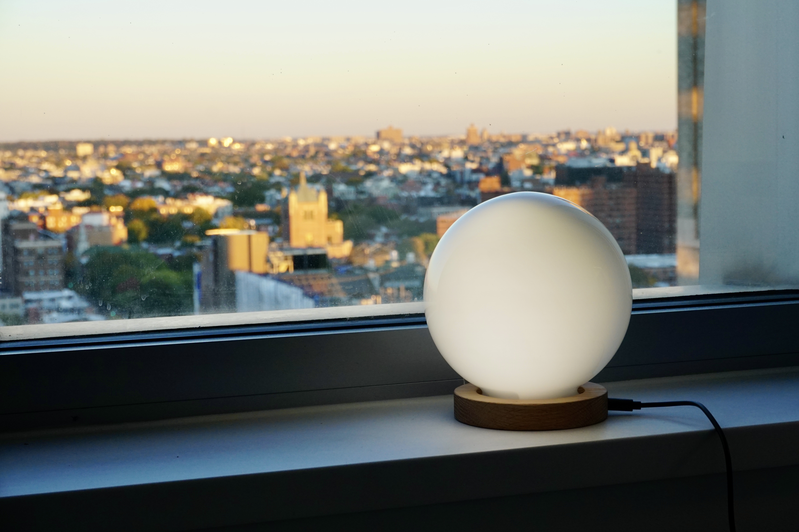

Because the earth is a sphere, the sun only illuminate half of it. ‘Time Globe’ is a lamp and also a clock that shows the time by the angle of the illuminated part. It makes a full turn once a day representing the sun shining at the earth. There is also different modes for other planets so you can have a sense of living on another planet.

---

Building blog: <https://itp.jasongao.me/time/time-globe>
