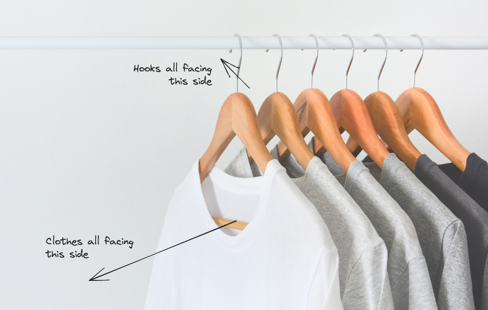
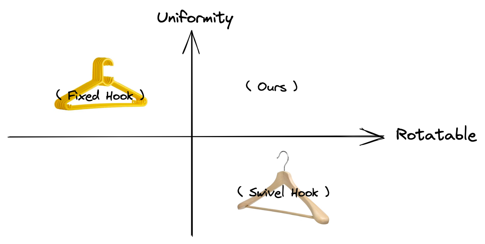
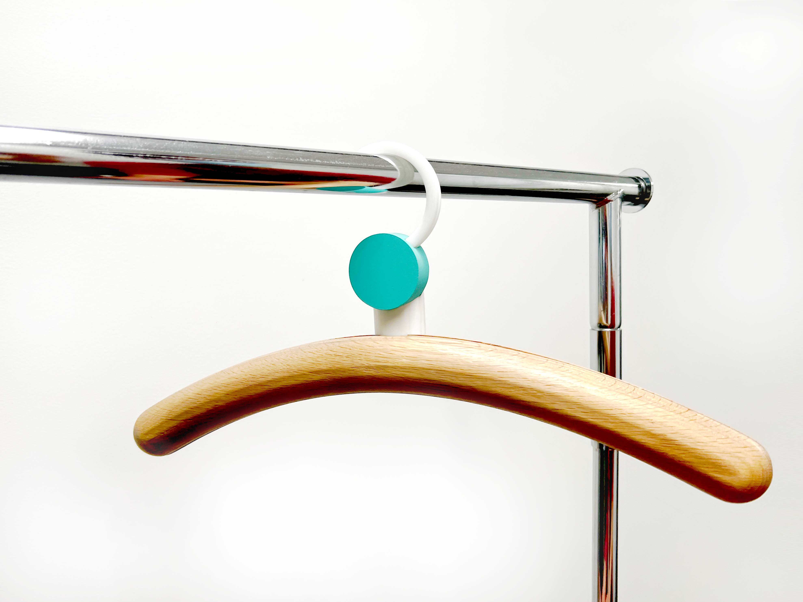
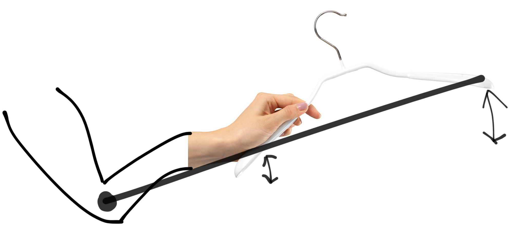
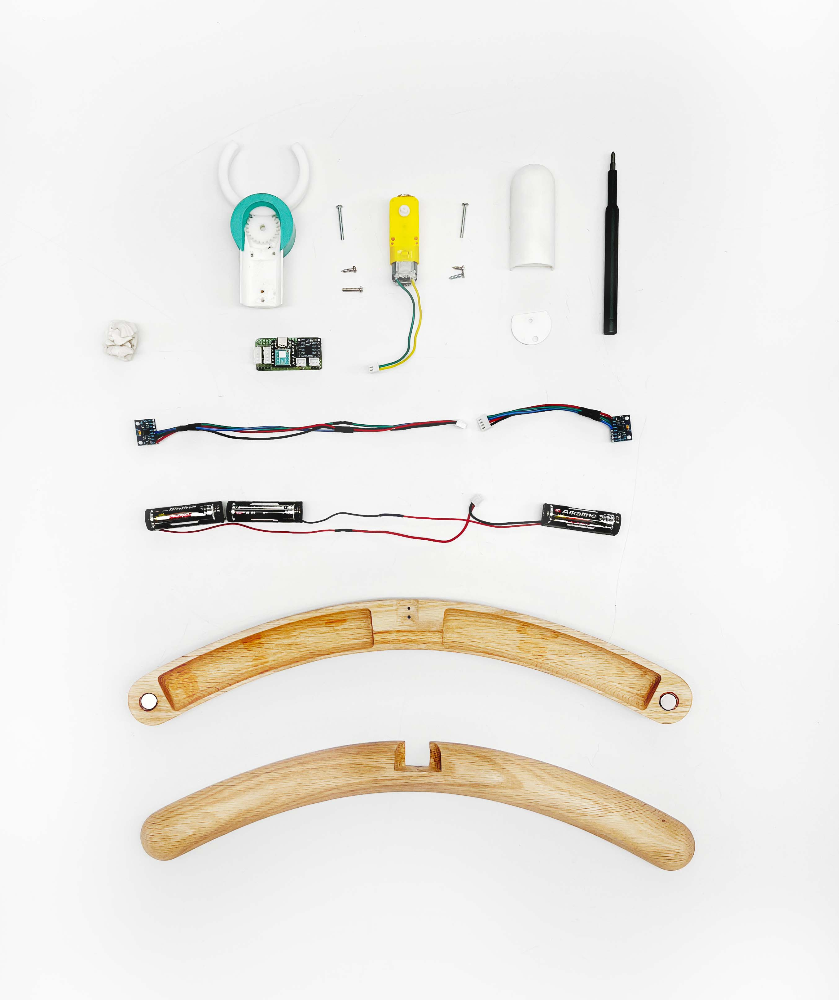
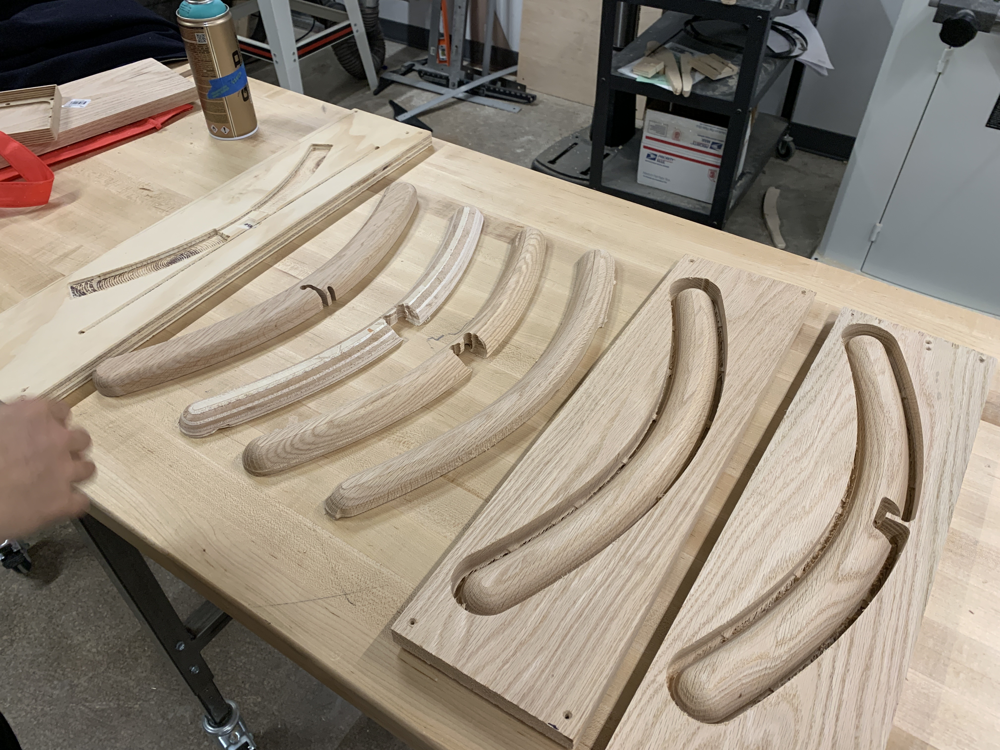
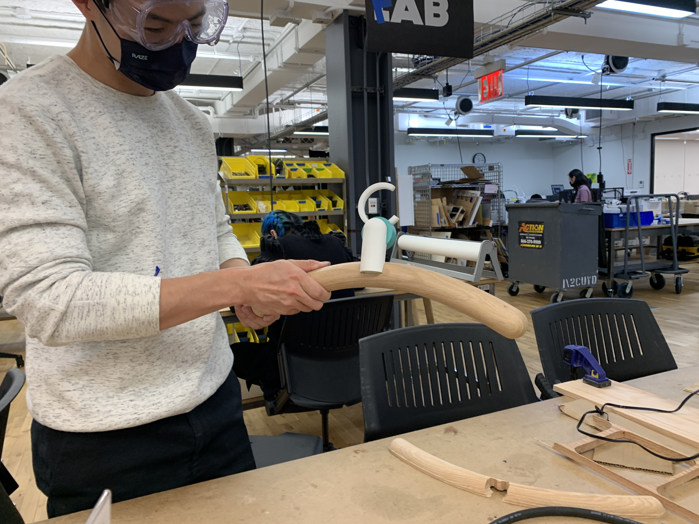

## Overview

We designed a hanger for people with OCD (Obsessive-Compulsive Disorder). The hanger detects which side the user holds and automatically rotates the hook towards the other side so it can be easily put on a rack.

<Video src="./demo.mp4" />

This project was developed for an imaginary Absurd Hotel in Japan. We designed and created an object for this hotel with a given set of CMF, including white oak, aluminum, transparent acrylic, white plastic, and malaquita for the color. This project is a collaboration between Michael Zhou and Jason Gao.

## Ideation

Have you ever encountered this, watching a bunch of clothes hanging in inconsistent positions and angles? It causes anxiety in people with OCD. The ideal state would be to have all the cloth facing the same side and the hook as well.

There are mainly two kinds of hangers, one with a fixed hook and the other with a swivel hook. A swivel hook makes it easier to switch the hook’s side after putting on cloth, but it could also rotate to different angles, creating an ununiformed look. Therefore, we decided to make a hanger that the hook stays fixed when hanging but can automatically rotate to the right angle when someone is holding it.

## Design

Each element of the hanger is designed with geometric shapes. We used a lot of repetition in the design to create harmony in this rather untraditional design. And stacking them together creates a cohesive yet unique form that reassembles a hanger.

### Electronic

One essential part of this idea was to detect the side the user is holding. we tried to solve this problem by detecting its motion to avoid placing sensors on the outside for a clean look. The model of a person holding a hanger can be simplified as a lever with the elbow as the pivot. Since body movement is inevitable, the far side (on the right in the following image) of the hanger would experience more shaking than the near side, so the less shaking side would be the side the person is holding.

We used two MPU6050 IMU sensors to measure accelerations on each side. The following equation is applied to eliminate the factor of gravity:

$$
Shake = a_x^2 + a_y^2 + a_z^2 - g^2
$$

A low-pass filter is also applied to remove high-frequency noise.

When the shake difference between the two sides exceeds a threshold, it triggers the rotation action. Here is a working prototype of this concept:

<Video src="./side_detect_prototype.mp4" caption="Side Detection Prototype" />

### Mechanics

The mechanics of the hook is minimal and simple yet brilliant. Instead of pivoting the hook on the z-axis, we developed a mechanism that rotates on the y-axis. By turning a 270-degree arch from one end to the other, we achieved the purpose of changing hook direction. We essentially sliced a hook in the middle and integrated a gear in between. Then placed another gear that pairs with the one on the hook. We got a simple but elegant rotational mechanism that can be driven by a singular motor.

<Video src="./hook.mp4" />

## Fabrication

We spent a tremendous amount of energy and attention fabricating this piece. We analyzed and used the most suitable technique available to us to create each individual component. We used the laser cutter to cut Delrin and assembled them into our hook mechanism with plastic glue. We 3D printed the central housing for the motor with tough white PLA. We did double-sided CNC on white oak to create our wooden frame with smooth curves and rounded ends. Every piece is hand-sanded and polished to get the final smooth finish that feels fanatic in hand.

We also designed the hanger assembly so it can be taken apart for fixation and updates quickly. Two pieces of the wooden frames are magnetically attached to each other. Motor and its housing are secured in place with a magnet and screws. And the placement of the housing is interlocked with the wooden frame, so they stay sturdy.

