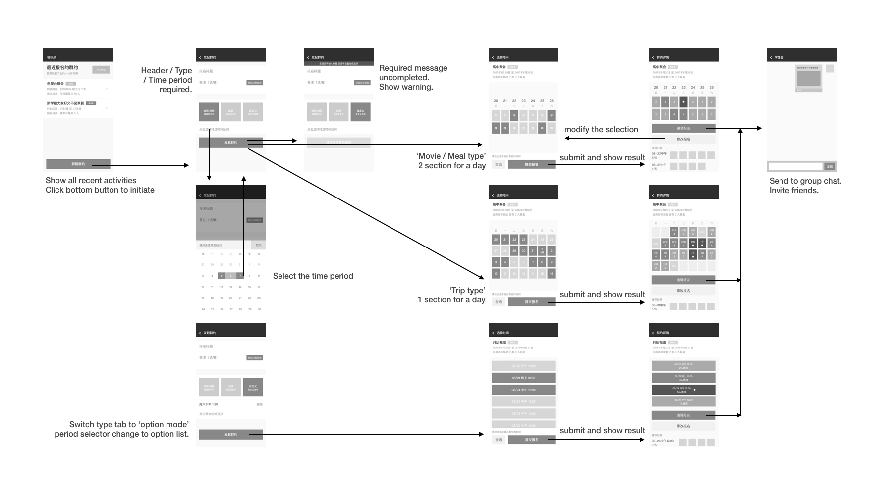

## Introduction

Natianyue is a WeChat mini program that helps people schedule group activities. It covers steps from making a plan to voting and finally sending reminders.

As a team of two people, we spent a month making the first version and launched in August 2017. By the end of 2020, we have released 6 major updates and gained over **100,000** users.

## Background

Whether it is an old class reunion or a colleague meeting, we inevitably need to coordinate everyone's time. If you encounter these conditions, you are also very embarrassed, because everyone has different arrangements. At this time, we need a person to count the time of everyone. But this job is hard and has a lot of pain, so we came up with the idea of making a group time scheduling tool.

### Why WeChat mini program

- It runs on both Android and iOS devices.
- The group chat API matches our demand.
- Easier to develop and iterate

### Research

We began the project by conducting semi-structured interviews with people who have the demand for arranging meetings or activities. The result shows that most of the people have had trouble arranging a meeting time. It's hard and time-consuming to ask all the participants about their free time, especially with strangers.

### Target Audience

- Friends who want to go out for meal or trip together.
- Colleague who need a meeting.

## Ideation

We began to design prototypes through sketches and storyboards.

## Iterations

We have done several iterations to improve the user experience.

### Creating vote

We used to have three picker view for selecting begin date, end date, and type. It took some time for users to understand what they are for.
Therefore, we replaced the type picker with a three-choice-tab. And then changed the two date pickers to a calendar period selector. It effectively reduce user's cognitive load.

### Making selection

The 'Select/Unselect All' button was originally placed at the bottom of all the choices. However, if there are too many options, users won't see this button since it is out of the screen.
Therefore, we placed the button at the bottom with fix place. So only the option list is scrollable. Users can always see the button now.

### Predicting type by ML

After running this application for more than a year, I found that many people have trouble understanding the difference between the three types. Without the right selection of type, 'Natianyue' won't play its value.

I worked with three teammates in an internship course for this iteration. This was a text classification problem, and we'd like to try to solve it by machine learning. So we built a Convolutional Neural Network (CNN) in Keras and trained it with the data the application had collected for the past year. The result showed an accuracy of 77%. Then, I deployed the model to the server, and it worked wonderfully.

## Visual Design

- Home Page - A place that shows all participated/initiated plan. Slide left to archive.
- Create Page - A place to submit the form to initiated a plan.
- Select Page - A place to make the selection to participate in a meeting.
- Info Page - A place that shows the result in two ways: A simple table of each section's number of votes and a detailed list of each section's every participant. You can also invite friends and export data here.

- Welcome Page - When the first time a user logged in, there will be a welcome page that introduces its feature.
- Empty/Loading State - I designed these pages for better user experience.

## Development

Wechat mini program works similar to a website, so as its development. It comes with a development framework similar to Vue, and the front-end code is hosted on Wechat’s server. Natianyue’s backend was initially written in Node.js with [Koa](https://koajs.com/). In 2020, I rewrote the code with [wxcloud](https://developers.weixin.qq.com/miniprogram/en/dev/wxcloud/basis/getting-started.html) (a serverless service, similar to Firebase) in order to reduce the cost of the server and long-time maintenance. wxcloud also provided some unique abilities like real-time push & object storage that are utilized in the application.

Code is open-sourced [here](https://github.com/jasongao97/natianyue) under MIT license. (documented in Chinese)
